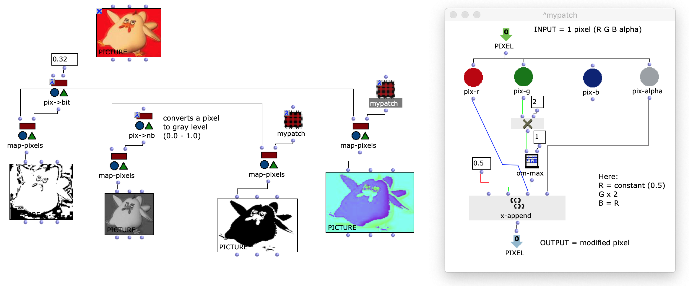

# Pixels

An OpenMusic library for basic image processing.

Pixels provide tools to read, process and generate picture data as 2D arrays of RGG, gray-scale pixels or bitmaps.

_Extract from Pixels tutorial patch_